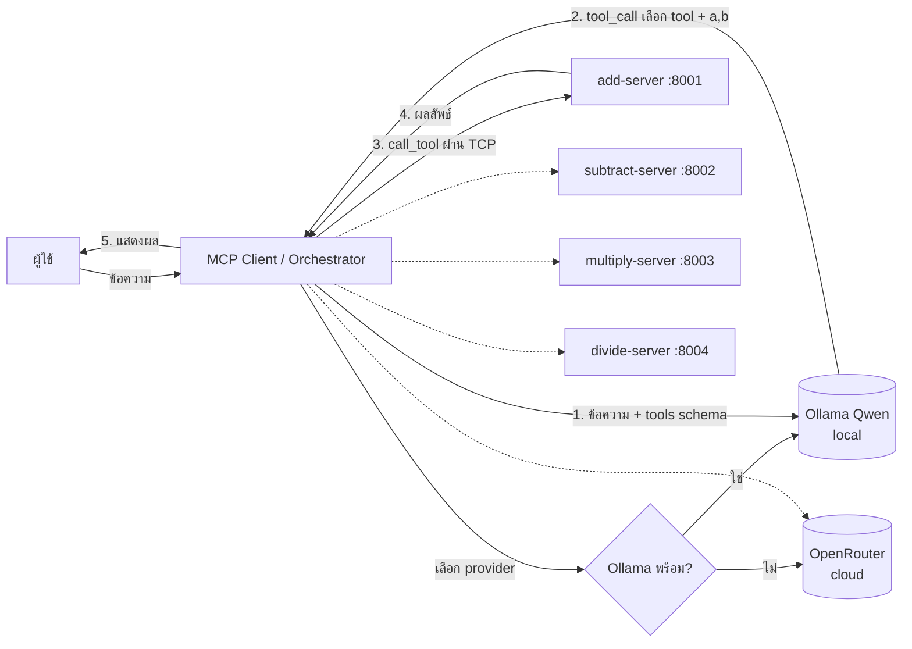
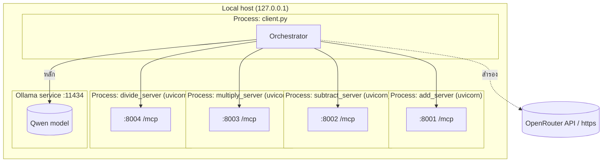
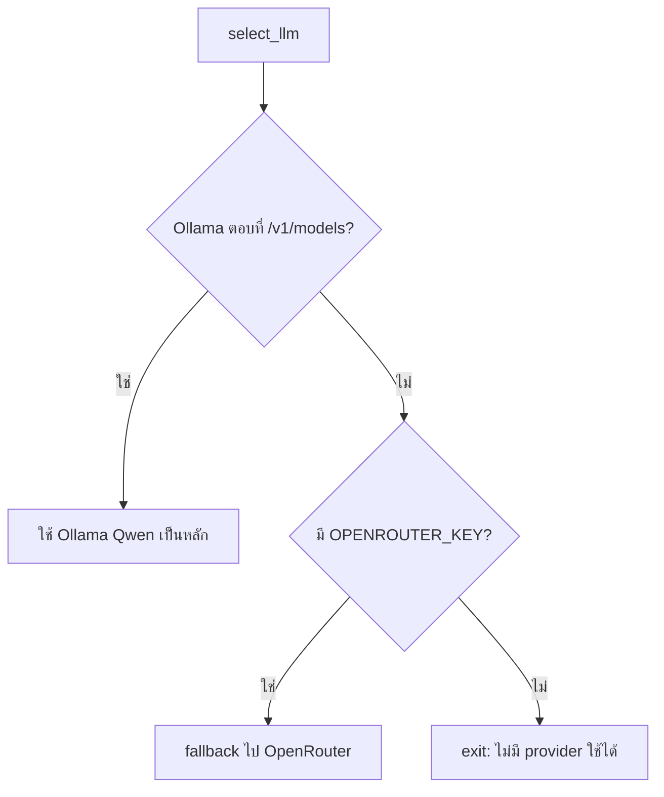
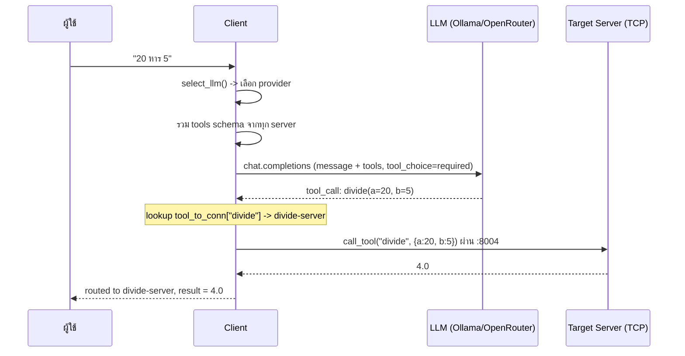

# System & Software Design — MCP Calculator Demo

เอกสารออกแบบระบบและซอฟต์แวร์ของโปรเจกต์ **MCP Calculator Demo** ระบบสาธิตการใช้
Model Context Protocol (MCP) ที่แยกการคำนวณเลขคณิตออกเป็น MCP server 4 ตัว (สื่อสาร
ผ่าน TCP) และใช้ LLM แบบสองชั้น (Ollama ในเครื่องเป็นหลัก, OpenRouter เป็นสำรอง)
เป็นตัวแยกวิเคราะห์ข้อความและเลือกว่าจะเรียก server/tool ตัวไหน

- เวอร์ชันเอกสาร: 2.0
- วันที่: 2026-09-30
- สถานะ: Implemented & tested

### ประวัติการแก้ไข
| เวอร์ชัน | การเปลี่ยนแปลงหลัก |
|----------|--------------------|
| 1.0 | ออกแบบเริ่มต้น: 4 server, client ใช้ OpenRouter, transport TCP (streamable-http) |
| 2.0 | เพิ่ม LLM สองชั้น (Ollama หลัก / OpenRouter สำรอง), รวม config ไว้ที่ `config.py` + `.env`, เพิ่มโหมด DEBUG |

---

## 1. บทนำ (Introduction)

### 1.1 วัตถุประสงค์
ระบบนี้สาธิตสถาปัตยกรรมแบบ MCP ที่:
- แยกความสามารถ (capability) แต่ละอย่างเป็น service อิสระ (microservice-style)
- ใช้ LLM แปลภาษาธรรมชาติ (ไทย/อังกฤษ) เป็นการเรียก tool ที่มีโครงสร้าง (structured tool call)
- สื่อสารระหว่าง client กับ server ผ่านเครือข่าย TCP
- เลือก LLM ในเครื่องก่อน (privacy/ออฟไลน์/ไม่มีค่าใช้จ่าย) แล้ว fallback ไปคลาวด์เมื่อจำเป็น

### 1.2 ขอบเขต (Scope)
รองรับการคำนวณเลขคณิตพื้นฐาน 4 อย่างกับตัวเลข 2 ตัว: บวก ลบ คูณ หาร
รับ input เป็นข้อความอิสระ เช่น `"12 + 3"`, `"หาผลบวกของ 5 และ 7"`, `"20 หาร 5"`

### 1.3 คำนิยามและอักษรย่อ
| คำ | ความหมาย |
|----|----------|
| MCP | Model Context Protocol — โปรโตคอลมาตรฐานให้ LLM/แอปเรียกใช้เครื่องมือภายนอก |
| Tool | ฟังก์ชันที่ MCP server เปิดให้เรียก (ในที่นี้คือ add/subtract/multiply/divide) |
| streamable-http | MCP transport แบบ HTTP บน TCP port |
| LLM | Large Language Model (Ollama ในเครื่อง หรือ OpenRouter บนคลาวด์) |
| Provider | ผู้ให้บริการ LLM ที่ client เลือกใช้ (Ollama หรือ OpenRouter) |
| Router | ตรรกะฝั่ง client ที่ route การเรียก tool ไปยัง server เจ้าของ |

---

## 2. ภาพรวมระบบ (System Overview)

ระบบประกอบด้วย 3 ส่วนหลัก:

1. **MCP Servers (4 ตัว)** — แต่ละตัวเปิด tool เดียว ฟังบน TCP port ของตัวเอง
2. **MCP Client / Orchestrator** — เชื่อมต่อทุก server, เลือก LLM provider, คุยกับ LLM, route และรวมผล
3. **LLM Provider (สองชั้น)** — ตัวแยกวิเคราะห์ข้อความและเลือก tool:
   - **หลัก:** Ollama ในเครื่อง (โมเดล Qwen) ผ่าน endpoint OpenAI-compatible
   - **สำรอง:** OpenRouter (ใช้อัตโนมัติเมื่อเชื่อมต่อ Ollama ไม่ได้)

หลักการออกแบบสำคัญ: **1 tool = 1 server** ดังนั้น "การเลือก tool" จึงเท่ากับ
"การเลือก server" การตัดสินใจนี้ทำโดย LLM ไม่ใช่ rule/regex



---

## 3. สถาปัตยกรรมระบบ (System Architecture)

### 3.1 มุมมองส่วนประกอบ (Component View)

| ส่วนประกอบ | ไฟล์ | หน้าที่ | Transport/Port |
|-----------|------|--------|----------------|
| Add Server | `servers/add_server.py` | tool `add(a,b)` | TCP 8001 `/mcp` |
| Subtract Server | `servers/subtract_server.py` | tool `subtract(a,b)` | TCP 8002 `/mcp` |
| Multiply Server | `servers/multiply_server.py` | tool `multiply(a,b)` | TCP 8003 `/mcp` |
| Divide Server | `servers/divide_server.py` | tool `divide(a,b)` | TCP 8004 `/mcp` |
| Launcher | `start_servers.py` | สตาร์ท server ทั้ง 4 เป็น subprocess | - |
| Client/Orchestrator | `client.py` | เลือก provider, LLM routing, รวมผล | HTTP client |
| Config module | `config.py` | โหลดค่าจาก `.env` รวมศูนย์ (single source of truth) | - |
| Config file | `.env` | ค่าปรับได้ทั้งหมด (endpoint/model/host/port/ฯลฯ) | - |

### 3.2 การเลือก Transport
MCP รองรับหลาย transport: `stdio`, `sse` (เก่า), `streamable-http`
ระบบนี้ต้องการให้ server ทำงานเป็นบริการบนเครือข่าย TCP จึงเลือก
**`streamable-http`** ซึ่งเป็น transport ที่ผูกกับ TCP port ได้ และเป็นแนวทางที่
SDK แนะนำในปัจจุบัน (แทน SSE เดิม) โดยแต่ละ server รันบน uvicorn/Starlette
ภายใต้ endpoint `/mcp` (ชื่อ transport และ path ตั้งค่าได้จาก `.env`)

### 3.3 มุมมองการ Deployment



แต่ละ server เป็น process แยกกัน ทำให้ล่ม/รีสตาร์ท/สเกลได้อิสระ
ทั้ง server และ client อ่านค่า host/port/ฯลฯ จาก `.env` ผ่าน `config.py`

---

## 4. การออกแบบซอฟต์แวร์ (Software Design)

### 4.0 Config Module (`config.py`) — Single Source of Truth
ค่าปรับได้ทุกตัวถูกกำหนดใน `.env` และโหลดที่ `config.py` เพียงจุดเดียว โมดูลอื่น
(`client.py`, `servers/*.py`, `start_servers.py`) `import config` แล้วใช้ค่าจากที่นี่
ทำให้ไม่มีค่าคงที่ (magic value) กระจายในโค้ด

- โหลด `.env` ด้วย `python-dotenv` โดยอ้างจาก path ของไฟล์ (ทำงานถูกไม่ว่าจะรันจาก directory ไหน)
- มี default ในตัวทุกค่า เผื่อ `.env` ขาดบาง key ระบบยังรันได้
- helper `server_url(port)` และ `SERVER_REGISTRY` (list ของ `(label, port)`) เป็นแหล่งกลาง
  ให้ทั้ง client และ launcher อ้างอิงชุด server เดียวกัน

### 4.1 MCP Server (แต่ละตัวโครงสร้างเหมือนกัน)

```python
import config
mcp = MCPServer("add-server")

@mcp.tool()
def add(a: float, b: float) -> float:
    """Add two numbers (a + b)."""
    return a + b

# host/port/transport มาจาก config (.env), override ด้วย --host/--port ได้
mcp.run(transport=config.MCP_TRANSPORT, host=host, port=port)
```

- ใช้ `MCPServer` (ชื่อใหม่ของ `FastMCP` ใน mcp SDK v2.x)
- decorator `@mcp.tool()` สร้าง JSON Schema ของ input อัตโนมัติจาก type hints
- `divide` มีการตรวจสอบหารด้วยศูนย์และ raise `ValueError`
- เนื่องจากถูกสตาร์ทเป็น subprocess จาก project root จึงเพิ่ม root เข้า `sys.path` เพื่อ `import config`

### 4.2 Client / Orchestrator (`client.py`)

องค์ประกอบหลักและความรับผิดชอบ:

| ฟังก์ชัน | ความรับผิดชอบ |
|---------|----------------|
| `ollama_available(timeout)` | probe `GET /v1/models` ของ Ollama ด้วย timeout สั้น (จาก config) คืน True/False |
| `select_llm()` | เลือก provider: Ollama ก่อน ถ้าไม่ได้ fallback ไป OpenRouter; คืน `(client, model, label)` |
| `open_servers(stack)` | เชื่อมต่อ TCP ทุก server, `initialize()`, `list_tools()`, สร้าง OpenAI tools schema, map `tool_name -> Connection` |
| `choose_tool_with_llm(...)` | ส่งข้อความ + tools schema ไป LLM ด้วย `tool_choice="required"` คืน `(tool_name, args)` (มี DEBUG log) |
| `call_tool(conn, ...)` | เรียก tool บน server เจ้าของ แยกข้อความผลลัพธ์และ flag error |
| `handle(...)` | ต่อขั้นตอนทั้งหมด: เลือก → route → เรียก → แสดงผลการตัดสินใจ |
| `run(messages)` | จัดการ lifecycle, เลือก provider, โหมด batch/interactive |

โครงสร้างข้อมูลสำคัญ:
- `tool_to_conn: dict[str, Connection]` — ตารางค้นหาว่า tool ไหนอยู่ server ไหน (แกนกลางของการ routing)
- `openai_tools: list[dict]` — tool schema รูปแบบ OpenAI ที่ป้อนให้ LLM

การจัดการ connection ใช้ `AsyncExitStack` เพื่อเปิด session ของทั้ง 4 server
ค้างไว้พร้อมกัน และปิดอย่างเป็นระเบียบเมื่อจบงาน

### 4.3 การเลือก LLM Provider (Provider Selection)



ทั้งสอง provider ใช้ interface แบบ OpenAI-compatible ผ่าน `openai` SDK ต่างกันแค่
`base_url`/model จึงเรียกใช้ด้วยโค้ดชุดเดียวกัน ไม่ต้องแยก branch การเรียก LLM

### 4.4 กลไกการเลือก Server (Server Selection)

นี่คือหัวใจของระบบ ลำดับการทำงาน:



จุดสำคัญ: การตัดสินใจเชิงความหมาย (ข้อความไหน = การคำนวณอะไร) เป็นหน้าที่ของ LLM
ทำให้รองรับได้ทั้งสัญลักษณ์ (`+ - * /`), คำไทย (บวก/ลบ/คูณ/หาร), และคำอังกฤษ
โดยไม่ต้องเขียนกฎเอง client เพียงทำหน้าที่ map tool → server และเรียกผ่าน TCP

### 4.5 การไหลของข้อมูล (Data Flow)
1. Input: ข้อความอิสระ (argument หรือ interactive)
2. Provider: `select_llm()` เลือก Ollama หรือ OpenRouter
3. Discovery: `list_tools()` จากทุก server → tools schema
4. Decision: LLM คืน tool + arguments (`a`, `b`)
5. Routing: `tool_to_conn` map ไปยัง server เจ้าของ
6. Execution: `call_tool` ผ่าน TCP → ผลลัพธ์ตัวเลขหรือ error
7. Output: แสดง tool ที่เลือก, server ที่ route, arguments, และผลลัพธ์

### 4.6 Observability (DEBUG mode)
เมื่อ `DEBUG` เปิด (ตั้งใน `.env` หรือ env override) `choose_tool_with_llm` จะพิมพ์
รายละเอียดจาก LLM: model, finish_reason, content ดิบ, tool_calls, token usage, และ
argument ที่ parse แล้ว ช่วยตรวจสอบว่า provider ไหนทำงานและตัดสินใจอย่างไร

---

## 5. Interface & Contract

### 5.1 Tool Contract (เหมือนกันทุก server)
- Input: `{ "a": number, "b": number }`
- Output (สำเร็จ): ข้อความ/ค่าตัวเลขผลลัพธ์
- Output (ผิดพลาด): ผลลัพธ์ที่มี `is_error = true` (เช่น หารด้วยศูนย์)

### 5.2 LLM Provider — สองชั้น (Ollama หลัก / OpenRouter สำรอง)

| ลำดับ | Provider | Endpoint (default) | โมเดล (default) | Auth |
|-------|----------|--------------------|-----------------|------|
| หลัก | Ollama (local) | `http://localhost:11434/v1` | `qwen3:8b` | ไม่ต้อง (key dummy) |
| สำรอง | OpenRouter | `https://openrouter.ai/api/v1` | `openai/gpt-4o-mini` | `OPENROUTER_KEY` |

**กลไกเลือก (`select_llm`)**: probe `GET /v1/models` ของ Ollama ด้วย timeout สั้น
ถ้าตอบ 200 → ใช้ Ollama; ถ้าไม่ → สลับไป OpenRouter (ถ้าไม่มี key ด้วยจะ exit)

### 5.3 Configuration (env / `.env`)

ค่าที่ปรับได้ทุกตัวถูกรวมศูนย์ไว้ใน `.env` และโหลดผ่านโมดูลเดียว `config.py`
(single source of truth) ทุกไฟล์—client, servers, launcher—import ค่าจาก `config.py`
ไม่มีค่าคงที่กระจายอยู่ในโค้ด แก้ที่ `.env` แล้วมีผลทั้งระบบ

| ตัวแปร | จำเป็น | ค่า default | ใช้โดย |
|--------|--------|-------------|--------|
| `OLLAMA_BASE_URL` | ไม่ | `http://localhost:11434/v1` | client |
| `OLLAMA_MODEL` | ไม่ | `qwen3:8b` | client |
| `OLLAMA_PROBE_TIMEOUT` | ไม่ | `2.0` | client |
| `OPENROUTER_BASE_URL` | ไม่ | `https://openrouter.ai/api/v1` | client |
| `OPENROUTER_KEY` | เฉพาะตอน fallback | - | client |
| `OPENROUTER_MODEL` | ไม่ | `openai/gpt-4o-mini` | client |
| `MCP_HOST` | ไม่ | `127.0.0.1` | server + client + launcher |
| `MCP_TRANSPORT` | ไม่ | `streamable-http` | server |
| `MCP_HTTP_PATH` | ไม่ | `/mcp` | server + client |
| `ADD_PORT`/`SUBTRACT_PORT`/`MULTIPLY_PORT`/`DIVIDE_PORT` | ไม่ | 8001–8004 | ทุกส่วน |
| `SERVER_SHUTDOWN_TIMEOUT` | ไม่ | `5` | launcher |
| `DEBUG` | ไม่ | ปิด | client |
| `SYSTEM_PROMPT` | ไม่ | prompt ตัวจัดเส้นทาง | client |

---

## 6. Technology Stack

| ชั้น | เทคโนโลยี |
|------|-----------|
| ภาษา | Python 3.14 |
| MCP SDK | `mcp` v2.2.0 (`MCPServer`, `ClientSession`, `streamable_http_client`) |
| Web server (transport) | uvicorn + Starlette (ภายใน streamable-http) |
| LLM access | `openai` SDK (ชี้ไปที่ Ollama หรือ OpenRouter ด้วย `base_url`) |
| LLM (หลัก) | Ollama + Qwen (`qwen3:8b`) รันในเครื่อง |
| LLM (สำรอง) | OpenRouter (`openai/gpt-4o-mini`) |
| Config | `python-dotenv` + `config.py` |

---

## 7. คุณลักษณะที่ไม่ใช่ฟังก์ชัน (Non-Functional)

- **Modularity/Scalability**: 1 tool = 1 process/port แยกกัน ขยาย/แทนที่ได้อิสระ
- **Extensibility**: เพิ่มการคำนวณใหม่ = เพิ่ม server ไฟล์ใหม่ + ลง entry ใน `SERVER_REGISTRY` (config)
- **Configurability**: ค่าทั้งหมดอยู่ที่ `.env` แก้แล้วมีผลทั้งระบบโดยไม่ต้องแตะโค้ด
- **Availability/Resilience**: ใช้ LLM ในเครื่องก่อน (ไม่พึ่งเน็ต) และ fallback อัตโนมัติเมื่อ Ollama ล่ม; server แต่ละตัวแยก process ล่มทีละตัวไม่กระทบตัวอื่น
- **Privacy/Cost**: เส้นทางหลักประมวลผลในเครื่อง ไม่ส่งข้อมูลออกและไม่มีค่าใช้จ่าย
- **Observability**: DEBUG mode + การพิมพ์การตัดสินใจ routing ทุกครั้ง (provider, tool, server, args, result)
- **Portability**: host/port/model/endpoint ตั้งค่าได้ผ่าน `.env`

---

## 8. ความปลอดภัย (Security Considerations)

- **API key**: `OPENROUTER_KEY` อยู่ใน `.env` — เพิ่มใน `.gitignore` แล้ว ไม่ควร commit
  และควร rotate หากเคยเปิดเผย
- **Local-first**: เส้นทางหลัก (Ollama) ประมวลผลในเครื่อง ลดความเสี่ยงข้อมูลรั่วออกนอก
- **Network exposure**: server bind ที่ `127.0.0.1` โดย default (เฉพาะเครื่อง) หากเปลี่ยน
  `MCP_HOST` เป็น `0.0.0.0` จะเปิดสู่เครือข่ายภายนอกและควรเพิ่มการยืนยันตัวตน/TLS
- **Untrusted input**: ข้อความผู้ใช้ถูกส่งให้ LLM; ผลลัพธ์ tool call ถูกตรวจว่าเป็น tool
  ที่รู้จักก่อน route (`tool_to_conn.get`) และ divide มีการป้องกันหารด้วยศูนย์
- **No PII**: ระบบประมวลผลเฉพาะตัวเลขที่ผู้ใช้ป้อน

---

## 9. การทดสอบ (Testing) & ผลการยืนยัน

ทดสอบแบบ end-to-end โดยสตาร์ท server ทั้ง 4 (ตรวจว่า TCP 8001–8004 อยู่สถานะ
LISTEN) แล้วรัน client

### 9.1 การเลือก server (provider = Ollama Qwen)
| ข้อความ | tool ที่เลือก | server ที่ route | ผลลัพธ์ |
|---------|--------------|------------------|---------|
| `12 + 3` | add | add-server:8001 | 15.0 |
| `หาผลบวกของ 5 และ 7` | add | add-server:8001 | 12.0 |
| `เอา 50 ลบ 8` | subtract | subtract-server:8002 | 42.0 |
| `10 คูณ 4` | multiply | multiply-server:8003 | 40.0 |
| `8 x 6` | multiply | multiply-server:8003 | 48.0 |
| `20 หาร 5` | divide | divide-server:8004 | 4.0 |
| `100 minus 45` | subtract | subtract-server:8002 | 55.0 |
| `9 หาร 0` | divide | divide-server:8004 | ERROR (หารด้วยศูนย์) |

ครอบคลุมทั้งสัญลักษณ์ ภาษาไทย ภาษาอังกฤษ และเส้นทางความผิดพลาด

### 9.2 การเลือก provider (fallback)
| สถานการณ์ | provider ที่เลือก |
|-----------|-------------------|
| Ollama ทำงานปกติ | `ollama (qwen3:8b)` |
| ชี้ `OLLAMA_BASE_URL` ไปพอร์ตที่ปิด | fallback อัตโนมัติเป็น `openrouter (openai/gpt-4o-mini)` |

---

## 10. ข้อจำกัดและงานในอนาคต (Limitations & Future Work)

- **การคำนวณเดี่ยว**: รองรับ 1 operation ต่อข้อความ ยังไม่รองรับนิพจน์ซ้อน เช่น `(2+3)*4`
- **คุณภาพขึ้นกับโมเดล**: โมเดลในเครื่องที่เล็กอาจตัดสินใจ tool ผิดในข้อความกำกวม
- **fallback ต้องมี key + เน็ต**: เส้นทางสำรองยังพึ่ง OpenRouter (latency/ค่าใช้จ่าย)
- **ไม่มี auth/TLS**: เหมาะกับการสาธิต local เท่านั้น
- **แนวทางพัฒนาต่อ**:
  - รองรับ multi-step tool calling สำหรับนิพจน์ซับซ้อน
  - เพิ่มการยืนยันตัวตน + TLS เมื่อ deploy ข้ามเครื่อง
  - เพิ่ม unit/integration test อัตโนมัติและ health-check endpoint
  - เพิ่ม provider ทางเลือกอื่น ๆ และกลไก retry/timeout ที่ปรับได้

---

## ภาคผนวก: โครงสร้างไฟล์

```
MCP/
├── servers/
│   ├── add_server.py         # tool add       -> TCP 8001
│   ├── subtract_server.py    # tool subtract  -> TCP 8002
│   ├── multiply_server.py    # tool multiply  -> TCP 8003
│   └── divide_server.py      # tool divide    -> TCP 8004
├── start_servers.py          # สตาร์ท server ทั้ง 4 ตัว
├── client.py                 # orchestrator + provider selection + LLM routing (TCP)
├── config.py                 # โหลด .env รวมศูนย์ (single source of truth)
├── requirements.txt          # mcp, uvicorn, openai, python-dotenv
├── .env                      # ค่า config ทั้งหมด (ไม่ commit)
├── .gitignore
├── README.md                 # คู่มือใช้งาน
└── DESIGN.md                 # เอกสารนี้
```
